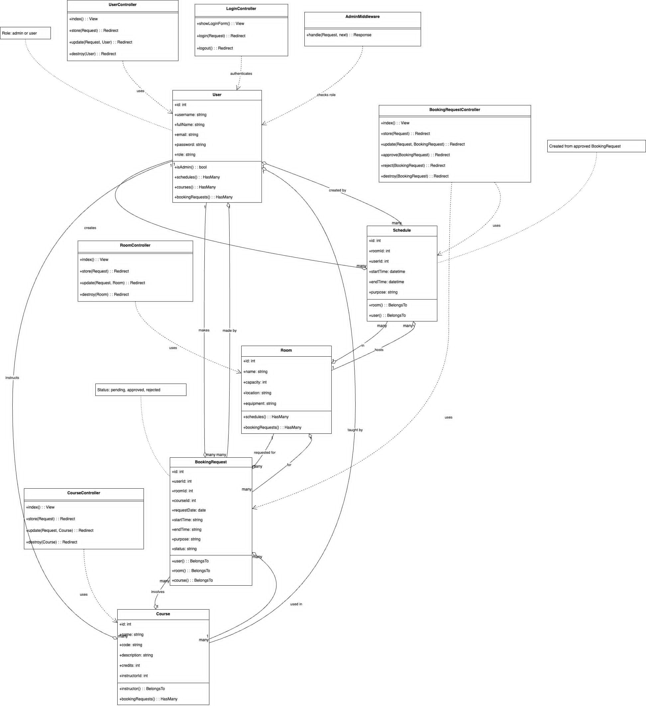
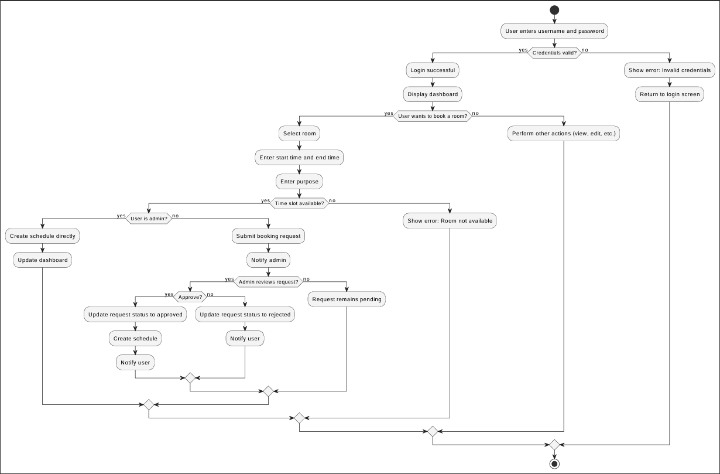

# classroom-management

# Web_quan_ly_lop_hoc

## 👤 Thông Tin Cá Nhân
* **Họ và tên**: Đỗ Hữu Ngọc
* **Mã sinh viên**: 23010822 
* **Lớp**: CNTT_8  
* **Môn học**: Xây dựng Web nâng cao (TH4)

## 🎯 Mục đích nghiên cứu
Mục tiêu chính của đề tài là xây dựng một hệ thống web quản lý lớp học nhằm hỗ trợ việc tổ chức, giảng dạy và học tập trong nhà trường trở nên hiệu quả và khoa học hơn. Ứng dụng tập trung vào việc tự động hóa các thao tác quản lý lớp học, khóa học, phòng học và lịch giảng dạy.

* Hệ thống được thiết kế nhằm:

- Cho phép người quản trị dễ dàng tạo, cập nhật và phân phối lịch học, phòng học.

- Hỗ trợ giảng viên và sinh viên theo dõi lịch học, đăng ký khóa học, gửi yêu cầu sử dụng phòng học.

- Đảm bảo thông tin được đồng bộ, cập nhật theo thời gian thực.

- Một trong các mục tiêu quan trọng là phát triển một giao diện thân thiện với người dùng, có thể truy cập dễ dàng từ nhiều thiết bị, giúp cải thiện trải nghiệm sử dụng và nâng cao hiệu quả quản lý học vụ.

* Ngoài ra, hệ thống hướng đến việc giảm thiểu sai sót trong công tác sắp xếp lịch học, tối ưu hóa việc sử dụng cơ sở vật chất, đồng thời hỗ trợ nhà trường trong việc đưa ra các quyết định quản lý dựa trên dữ liệu thống kê từ hệ thống.

## 📌 Đối tượng và phạm vi nghiên cứu
Đối tượng nghiên cứu: Hệ thống ứng dụng web phục vụ công tác quản lý lớp học, lịch học và phòng học trong các cơ sở giáo dục.

Đối tượng sử dụng: Sinh viên, giảng viên và quản trị viên tại các trường học có nhu cầu quản lý, tra cứu và điều phối lịch học.

Phạm vi nghiên cứu: Tập trung phát triển các tính năng cốt lõi như đăng ký lớp học, tạo lịch giảng dạy, gửi yêu cầu đặt phòng, phân quyền người dùng, và xây dựng giao diện quản lý dễ sử dụng, thân thiện với mọi đối tượng người dùng.

## 💻 Hệ Thống Sử Dụng
Ngôn ngữ: PHP (Laravel Framework) Laravel là framework mạnh mẽ hỗ trợ phát triển web theo kiến trúc MVC.

Cơ sở dữ liệu (CSDL): MySQL Sử dụng hệ quản trị cơ sở dữ liệu quan hệ để lưu trữ thông tin người dùng, lớp học, lịch học,…

Giao diện người dùng (Frontend): Blade Template, Bootstrap 5, TailwindCSS Giao diện xây dựng bằng Blade của Laravel, kết hợp Bootstrap 5 & Tailwind CSS để tối ưu trải nghiệm người dùng.

Xác thực người dùng: Laravel Breeze Hỗ trợ chức năng đăng ký, đăng nhập, phân quyền đơn giản nhưng hiệu quả.

ORM: Eloquent ORM Eloquent giúp thao tác với CSDL thông qua các model như User, Course, Room, Schedule…

Tìm kiếm & Tương tác bất đồng bộ: AJAX (JQuery) Sử dụng AJAX giúp thao tác mượt mà mà không cần tải lại trang.

## Sơ đồ Cấu trúc
# Web_quan_ly_lop_hoc

## 👤 Thông Tin Cá Nhân
* **Họ và tên**: Đỗ Hữu Ngọc
* **Mã sinh viên**: 23010822 
* **Lớp**: CNTT_8  
* **Môn học**: Xây dựng Web nâng cao (TH4)

## 🎯 Mục đích nghiên cứu
Mục tiêu chính của đề tài là xây dựng một hệ thống web quản lý lớp học nhằm hỗ trợ việc tổ chức, giảng dạy và học tập trong nhà trường trở nên hiệu quả và khoa học hơn. Ứng dụng tập trung vào việc tự động hóa các thao tác quản lý lớp học, khóa học, phòng học và lịch giảng dạy.

* Hệ thống được thiết kế nhằm:

- Cho phép người quản trị dễ dàng tạo, cập nhật và phân phối lịch học, phòng học.

- Hỗ trợ giảng viên và sinh viên theo dõi lịch học, đăng ký khóa học, gửi yêu cầu sử dụng phòng học.

- Đảm bảo thông tin được đồng bộ, cập nhật theo thời gian thực.

- Một trong các mục tiêu quan trọng là phát triển một giao diện thân thiện với người dùng, có thể truy cập dễ dàng từ nhiều thiết bị, giúp cải thiện trải nghiệm sử dụng và nâng cao hiệu quả quản lý học vụ.

* Ngoài ra, hệ thống hướng đến việc giảm thiểu sai sót trong công tác sắp xếp lịch học, tối ưu hóa việc sử dụng cơ sở vật chất, đồng thời hỗ trợ nhà trường trong việc đưa ra các quyết định quản lý dựa trên dữ liệu thống kê từ hệ thống.

## 📌 Đối tượng và phạm vi nghiên cứu
Đối tượng nghiên cứu: Hệ thống ứng dụng web phục vụ công tác quản lý lớp học, lịch học và phòng học trong các cơ sở giáo dục.

Đối tượng sử dụng: Sinh viên, giảng viên và quản trị viên tại các trường học có nhu cầu quản lý, tra cứu và điều phối lịch học.

Phạm vi nghiên cứu: Tập trung phát triển các tính năng cốt lõi như đăng ký lớp học, tạo lịch giảng dạy, gửi yêu cầu đặt phòng, phân quyền người dùng, và xây dựng giao diện quản lý dễ sử dụng, thân thiện với mọi đối tượng người dùng.

## 💻 Hệ Thống Sử Dụng
Ngôn ngữ: PHP (Laravel Framework) Laravel là framework mạnh mẽ hỗ trợ phát triển web theo kiến trúc MVC.

Cơ sở dữ liệu (CSDL): MySQL Sử dụng hệ quản trị cơ sở dữ liệu quan hệ để lưu trữ thông tin người dùng, lớp học, lịch học,…

Giao diện người dùng (Frontend): Blade Template, Bootstrap 5, TailwindCSS Giao diện xây dựng bằng Blade của Laravel, kết hợp Bootstrap 5 & Tailwind CSS để tối ưu trải nghiệm người dùng.

Xác thực người dùng: Laravel Breeze Hỗ trợ chức năng đăng ký, đăng nhập, phân quyền đơn giản nhưng hiệu quả.

ORM: Eloquent ORM Eloquent giúp thao tác với CSDL thông qua các model như User, Course, Room, Schedule…

Tìm kiếm & Tương tác bất đồng bộ: AJAX (JQuery) Sử dụng AJAX giúp thao tác mượt mà mà không cần tải lại trang.

## Sơ đồ Cấu trúc

## Sơ đồ Thuật toán



## 🔍 Code minh họa phần chính của project

```php

store() – Tạo phòng 

public function store(Request $request)
{
    $request->validate([
        'name' => ['required', 'string', 'max:255', 'unique:rooms'],
        'capacity' => ['required', 'integer', 'min:1'],
        'location' => ['required', 'string', 'max:255'],
        'equipment' => ['nullable', 'string'],
    ]);

    Room::create($request->all());

    return redirect()->route('dashboard')->with('success', 'Room created successfully!');
}


update() – Cập nhật thông tin phòng

public function update(Request $request, Room $room)
{
    $request->validate([
        'name' => ['required', 'string', 'max:255', Rule::unique('rooms')->ignore($room->id)],
        'capacity' => ['required', 'integer', 'min:1'],
        'location' => ['required', 'string', 'max:255'],
        'equipment' => ['nullable', 'string'],
    ]);

    $room->update($request->all());

    return redirect()->route('dashboard')->with('success', 'Cập nhật phòng học thành công!');
}


Hàm destroy() – Xóa phòng học

public function destroy(Room $room)
{
    if ($room->schedules()->exists() || $room->bookingRequests()->exists()) {
        return redirect()->route('dashboard')->with('error', 'Không thể xóa phòng vì đang được sử dụng trong lịch hoặc yêu cầu đặt phòng!');
    }

    $room->delete();
    return redirect()->route('dashboard')->with('success', 'Xóa phòng học thành công!');
}


Room.php – Model đại diện cho bảng phòng học

class Room extends Model
{
    use HasFactory;

    protected $table = 'rooms';

    protected $fillable = [
        'name',
        'capacity',
        'location',
        'equipment',
    ];

    protected function casts(): array
    {
        return [
            'capacity' => 'integer',
        ];
    }

    public function schedules(): HasMany
    {
        return $this->hasMany(Schedule::class, 'roomId');
    }

    public function bookingRequests(): HasMany
    {
        return $this->hasMany(BookingRequest::class, 'roomId');
    }
}

editRoom.blade.php – Giao diện cập nhật thông tin phòng


<div id="editRoomModal" class="modal">
    <div class="modal-content">
        <span class="close" onclick="closeModal('editRoomModal')">&times;</span>
        <h2>Sửa phòng học</h2>
        <form method="POST" id="editRoomForm">
            @csrf
            @method('PUT')
            <input type="hidden" id="editRoomId" name="id">

            <label for="editRoomName">Tên phòng:</label>
            <input type="text" id="editRoomName" name="name" required>

            <label for="editRoomCapacity">Sức chứa:</label>
            <input type="number" id="editRoomCapacity" name="capacity" min="1" required>

            <label for="editRoomLocation">Vị trí:</label>
            <input type="text" id="editRoomLocation" name="location" required>

            <label for="editRoomEquipment">Thiết bị:</label>
            <textarea id="editRoomEquipment" name="equipment"></textarea>

            <button type="submit" class="btn btn-primary">Cập nhật</button>
        </form>
    </div>
</div>


 Link repo:
🔗 [View full source code on GitHub](https://github.com/dohuungoc1805/classroom-management)